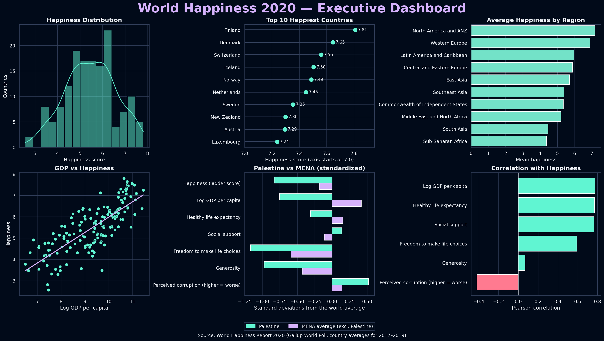
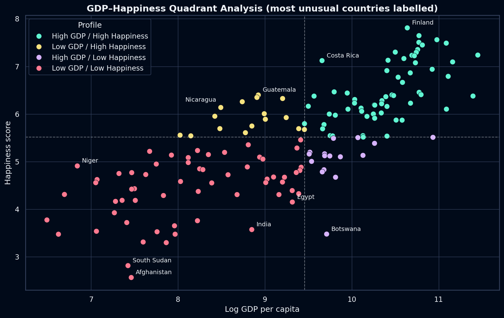
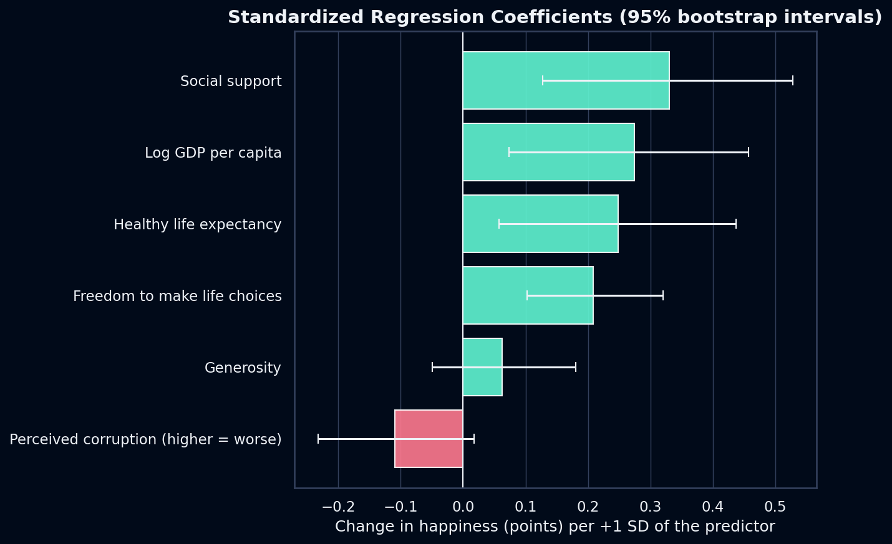

# 🌍 World Happiness 2020 — What Really Drives National Happiness?

An end-to-end exploratory and statistical analysis of the **World Happiness Report 2020** (153 countries, Gallup World Poll averages for 2017–2019). It asks which factors go together with national happiness, how regions differ, which countries break the GDP–happiness pattern, and how the Palestinian Territories compare with the rest of the Middle East and North Africa (MENA).



## Key findings

1. **Income, health and social ties are almost tied at the top.** Log GDP per capita (r = 0.775), healthy life expectancy (0.770) and social support (0.765) correlate most strongly with happiness, followed by freedom (0.591) and perceived corruption (−0.418). Generosity is essentially uncorrelated (0.069).
2. **GDP matters, but it is not the whole story.** Log GDP alone explains about 60% of the variation (R² = 0.60), yet 32 of 153 countries (21%) fall in "mismatch" quadrants. Botswana sits 2.3 points below the GDP–happiness line; Costa Rica sits 1.4 points above it.
3. **Regions differ a lot.** Average happiness ranges from 7.17 (North America & ANZ) to 4.38 (Sub-Saharan Africa). MENA (5.23) is the second most internally diverse region, from Israel (7.13) to Yemen (3.53).
4. **Palestinian Territories vs MENA.** They rank 125th of 153 globally (4.55) and 14th of 17 in MENA, 0.72 points below the average of the other 16 MENA countries. They are lower on income, life expectancy, freedom and generosity, slightly higher on social support, and higher on perceived corruption. Relative to the global GDP–happiness pattern the gap is modest (−0.27 points).
5. **Modeling.** A six-variable linear model reaches an out-of-sample R² of 0.70 ± 0.10 (repeated 5-fold cross-validation, MAE ≈ 0.46 points). Social support, GDP, life expectancy and freedom each keep an independent association with happiness (95% bootstrap intervals exclude zero); perceived corruption and generosity do not once the others are included.

> All results are **associations in country-level data**, not causal effects.

| GDP–happiness quadrants | Regression coefficients |
|---|---|
|  |  |

## What the notebook does

1. **Data audit** — types, missing values, duplicates, ranges, and a check that the report's `Explained by: …` columns add up to the ladder score (so they are excluded as predictors).
2. **Preparation & feature engineering** — clean names, global rank, GDP quartiles.
3. **Exploratory analysis** — distribution, regional comparison, GDP vs happiness.
4. **Correlation analysis** — full matrix, with a note on overlapping predictors.
5. **GDP quartiles and outliers** — median-split quadrants plus residuals from the GDP–happiness line to find the genuinely unusual countries.
6. **Palestine vs MENA** — compared with the other 16 MENA countries (not with a region average that includes Palestine), on a standardized scale so every metric is visible.
7. **Multiple linear regression** — standardized predictors, VIF check, repeated 5-fold cross-validation instead of a single small test set, bootstrap confidence intervals.
8. **Executive dashboard, findings and limitations.**

## Repository structure

```
.
├── world_happiness_2020_portfolio.ipynb   # the full analysis (executed, outputs included)
├── data/
│   └── WHR20_DataForFigure2.1.csv         # World Happiness Report 2020, Figure 2.1 data
├── images/                                # figures exported by the notebook
├── requirements.txt
└── README.md
```

## Run it yourself

```bash
git clone https://github.com/<your-username>/world-happiness-2020-analysis.git
cd world-happiness-2020-analysis

python -m venv .venv
source .venv/bin/activate        # Windows: .venv\Scripts\activate
pip install -r requirements.txt

jupyter lab world_happiness_2020_portfolio.ipynb
```

Run the notebook from the repository root: it reads `data/WHR20_DataForFigure2.1.csv` and writes its figures to `images/`.

**Tested with** Python 3.12 on two environments: the minimum versions in `requirements.txt` (pandas 2.2.3, numpy 1.26.4, matplotlib 3.8.4, seaborn 0.13.2, scikit-learn 1.4.2) and the latest releases at the time of writing (pandas 3.0, numpy 2.4, matplotlib 3.10, scikit-learn 1.8). Results are identical in both.

## Data

- **Source:** *World Happiness Report 2020*, Figure 2.1 data (`WHR20_DataForFigure2.1.csv`). Helliwell, J. F., Layard, R., Sachs, J. D., & De Neve, J.-E. (Eds.). (2020). *World Happiness Report 2020*. Sustainable Development Solutions Network. [Full report (PDF)](https://files.worldhappiness.report/WHR20.pdf) · [Data downloads](https://worldhappiness.report/)
- **Content:** 153 countries × 20 columns. Values are Gallup World Poll country averages for **2017–2019**, i.e. before the COVID-19 pandemic.
- **Ownership:** the data belongs to its original authors and is included here (about 38 KB) only so the notebook runs out of the box. See the official website for the terms of use.

## Limitations

Cross-sectional and pre-pandemic data; correlation is not causation; country-level averages say little about individuals; every country has equal weight regardless of population; ladder scores carry measurement error (standard errors of about 0.03–0.12); GDP, life expectancy and social support overlap strongly, so their individual coefficients are imprecise. Section 15 of the notebook gives the full list.

## Possible next steps

- Extend to several report years to study change over time.
- Add region effects (mixed-effects model) and robustness checks such as robust regression.
- Propagate the uncertainty in the ladder scores using the report's standard errors.
- Build an interactive version of the dashboard (Plotly or Streamlit).

## About

**Author:** [Your Name](https://www.linkedin.com/in/your-profile) · [GitHub](https://github.com/your-username)
